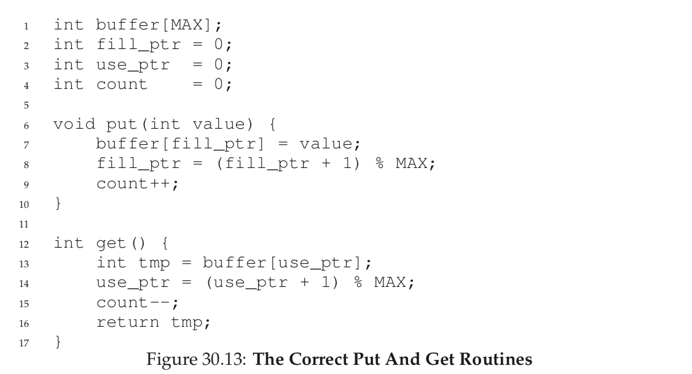

## Process  

### Virtualizing CPU  
* __Goal:__ give each process the illusion of exclusive CPU access  
* __Reality:__ the CPU is a shared resource among all processes  
* Two approaches
  * time sharing: alternate between tasks  
  * space sharing: memory/disk  

__Policy:__ which process to run  
__Mechanism:__ how to switch from one process to another  

__Process State Transitions__  
  

__Idle Process__  
* schedules and executes if no other processes are ready  
* never blocks or executes any I/O  
* guarantees that there is always at least one process to run  

__fork() example__  
  

## Scheduling  
The __scheduling policy__ tells us which process we should run at any given time.  

__Scheduler Mertics__  
1. __Utilization:__ what fraction of time is the CPU executing a program (goal: maximize)
2. __Turnaround time:__ total global time from process creation to process exit (goal: minimize)  
3. __Response time:__ time from becoming ready to being scheduled (goal: minimize)  
4. __Fairness:__ all processes get same amount of CPU over time (goal: no starvation)  
5. __Progress:__ allow processes to make forward progress (goal: minimize kernel interrupts)  

* __Non-preemptive__ schedulers only switch to another process if the current process gives up the CPU voluntarily.  
* __Preemptive__ schedulers may take control of the CPU at any time, switching to another process according to the scheduling policy.

### First In, First Out (FIFO)  
|  |  |  
|:--:|:--:|  

* Long tasks may reduce the performance
* Non-preemptive  

### SJF: Shortest Job First  
Choose ready job with shortest runtime  

|  |  |  
|:--:|:--:|  

* Problem if the long tasks arrives before the others  
* Non-preemptive  

### STCF (Shortest Time to Completion First)   
  

* Preemptive

### Round Robin (RR)  
* Previous schedulers optimize for turnaround.  
* Optimize response time: alternate ready processes every fixed-length time slice.

  

### MLFQ (Multi-Level Feedback Queue)  
* __Goal:__ general purpose scheduling. Must support both long running background tasks (batch processing) and low latency foreground tasks (interactive processing).
  * Batch processing: response time not important, cares for long run times  
  * Interactive processes: response time critical, short bursts  

__Rules:__  
1. If priority(A) > priority(B) then A runs.
2. If priority(A) == priority(B) A, B run in RR
3. New processes start with top priority  
4. If process uses up whole time slice, demote it to lower priority (time slices get longer at lower priority)
5. Periodically boost priority of all tasks that haven’t run  
6. Account for total time at priority level (and not just time of the last time slice), downgrade when threshold is exceeded  

## Segmentation  
Goals for multiprogramming:  
1. __Transparency:__ processes are unaware of memory sharing and the existence of other processes
2. __Protection:__ OS/other processes are isolated from process (read/write)
3. __Efficiency:__  
  * do not waste resources  
  * run close to the metal as much as possible  
4. __Sharing:__ processes may share part of address space  

__Address space:__  each process has a set of addresses that map to data  
  * _Static:_ code, global variables  
  * _Dynamic:_ stack, heap  

Example:  
  

### Virtualizing memory
#### time sharing  
* OS virtualizes CPU by storing register state to memory  
* Could virtualize memory by storing state to disk  
* __Disadvantage:__ incredibly bad performance due to I/O latency  

#### Static relocation  
* When loading a program, relocate it to an assigned area  

__Issues:__
* no separation between processes  
* fragmentation: address space is occupied/fixed as long as program runs  

### Dynamic relocation  
* Hardware relocates accesses just-in-time  
* Hardware mechanism translates each memory address from the program’s viewpoint to the hardware’s viewpoint (from _virtual address (VA)_ to _physical address (PA)_)  

### MMU (Memory Management Unit)  
* Translates virtual (logical) addresses to PAs  
* Controlled by OS  

__A simple MMU: base register__    
  
* Translate virtual to physical addresses by adding offset  
* Store offset in special register (controlled by OS, used by MMU)  
* Each process has a different offset in their base register  

Problem: Process P1 with the offset lower in memory than P2's offset can access P1's memory  

__A simple MMU: base and bounds__  
* Base register sets minimum address  
* Bounds register sets maximum address  

_Advantages:_
* Secure
* Performant  

_Problems:_
* Waste of physical memory (all must be allocated)  
* No (easy) sharing between processes  

__A simple MMU: segmentation__  
* Instead of a single base/bounds register pair, have one pair per memory area  

Registers: code, data, stack, extra registers  

## Paging and Swapping
* Segmentation of the Virtual Memory:  chop things up into variable-sized pieces -> space becomes fragmented -> allocation becomes challenging over time
* Paging: hop up space into fixed-sized pieces  
__Page:__ fixed-sized unit  
Physical memory is an array of fixed-sized __page frames__  
Example: 64 bytes address space with four 16-byte pages:  
  

__Advantages:__
* flexibility  
* simplicity  
* No external fragmentation  
* Fast to allocate (no searching for space) and free (no coalescing)  
* Simple to adjust what subset is mapped in core  

__Disadvantages:__  
* Internal fragmentation (tension regarding page size)  
* Additional memory reference to page table (hint: use a cache)  
* Required space for page table may be substantia  

__Translate from VA to PA__  
_Example 1:_   
Virtual address space: 64 bytes  
Page size: 16 bytes  
Virtual address to translate: 21
Virtual address space of 64 = 2^6 bytes => need 6 bits in total for our virtual address  
Page size 16 = 2^4 bytes => need offset of 4 bytes to search within the page  
6-4 = 2 remaining bits will store the __virtual page number (VPN)__  
  
Then look up for the translation of VPN #01 to the __physical frame number(PFN)__ or __physical page number (PPN)__  in the __page table__ of the process  
  
We get 111(b) = 7, the offset remains the same  => physical address: 1110101(b) = 117  

_Example 2:_
* Virtual address space: 4 GiB -> 2^2*2^20 = 2^32 bytes -> 32 bits for virtual address  
* Physical address space: 256 TiB -> 2^8*2^40 = 2^48 bytes => 48 bits for physical address
* Page size: 4 KiB -> 2^2*2^10 = 2^12 bytes -> 12 bytes to look within the page

Page numbers use 32-12 = 20 bits -> process may reference 2^20 pages  
Frame numbers use 48-12 = 36 bits -> there is a maximum of 2^36 physical frames in the system  

_Example 3:_  
Let’s assume a 16 bit virtual, a 20 bit physical address space, and 12 bit pages.
* Bits remaining for Virtual Page Number: 16-12 = 4 => 2^4 = 16 pages per process   
* Number of physical pages: 20-12 = 8 => 2^8 physical pages  

### Paging: a multi-level table  
  
* What size should the individual levels be?  
* Idea: use page granularity for 32 bit virtual/physical!  
  * 4 KiB pages: 1024 x 4 B entries  
  * 1024 entries correspond to 10 bit  
  * break address into 10 bit first level, 10 bit second level, 12 bit offset: 0x3ff 0x3ff 0xfff

  

### Swapping  
Main memory may not be enough for all memory of all processes -> store unused pages of address space on disk  
* Allows the OS to reclaim memory when necessary
* Allows the OS to over-provision (hand out more memory than physically available)  
* When needed, the OS finds and pushes unused pages to disk
* Careful strategy needed to avoid deadlock or performance degradation  

## Locks (OSTEP Chapter 28)  
  
* Calling the routine lock() tries to acquire the lock; if no other thread holds the lock (i.e., it is free), the thread will acquire the lock and enter the crit- ical section  
* Once the owner of the lock calls unlock(), the lock is now available (free) again  
__coarse-grained strategy:__ one big lock that is used any time any critical section is accessed  
__fine-grained strategy:__ protect different data and data structures with different locks  

### Evaluating Locks  
1. Locks must ptovide __mutual exclusion__  
2. __Fairness__  
  * Does each thread contending for the lock get a fair shot at acquiring it once it is free?  
  * Does any thread contending for the lock starve while doing so, thus never obtaining it?  
3. __Performance__  
  * The time overheads added by using the lock   

#### Controlling Interrupts  
* Disable interrupts for critical sections (single-processor systems) -> code inside the critical section will not be interrupted -> it will execute as if it was atomic  

__Advantages:__  
* simple  

__Disadvantages:__  
* _privileged_ operation (turning interrupts on and off) is allowed to any program -> any program can monopolize the processor  
* does not work on _multiprocessors_  
* turning off interrupts for extended periods of time can lead to _interrupts becoming lost_  
* _inefficient_  

#### Faulty Spin Lock  
__Spin waiting technique:__ endlessly check the value of the flag  
  
__Bug:__ both threads can grab the lock if thread is preempted before setting the lock but after the while loop completes, see below:  
  

#### Peterson's Spin Lock  
Only for 2 threads  
  

#### Test-And-Set  
Needs a hardware support: an __atomic exchange__ instruction, shown below  
  
This instruction enables the following test and set spin locking technique:  
  
Requires a __preemptive scheduler__. Without preemption, spin locks don’t make much sense on a single CPU, as a thread spinning on a CPU will never relinquish it.  

#### Spin Locks: evaluation  
* Correct: provide mutual exclusion  
* Not fair: one thread can hold the lock forever  
* Not performant on the single CPU: while loops can for the whole duration of the time slice. Work reasonably well on multiple CPU.  

#### Compare-And-Swap  
Requires the hardware primitive __compare-and-swap:__  
  

#### Reduce Spinning: yield()  
  

#### Ticket Locks    
Requires the __fetch-and-add__ instruction:  
  
  

When a thread wishes to acquire a lock, it first does an atomic fetch-and-add on the ticket value; that value is now considered this thread’s “turn” (myturn). The globally shared lock->turn is then used to determine which thread’s turn it is; when (myturn == turn) for a given thread, it is that thread’s turn to enter the critical section.  

Unlock is accomplished simply by incrementing the turn such that the next waiting thread (if there is one) can now enter the critical section.  

#### Queue Lock  
__Solaris:__  

 `park()` puts a calling thread to sleep  
 `unpark(threadID)` wakes a particular thread as designated by threadID  
  
* Avoids starvation: the queue helps to control who gets the lock next.  
* A thread might be interrupted while acquiring or releasing the lock, and thus cause other threads to spin-wait for this one to run again. But this is not critical.  
* The flag does not get set back to 0 when another thread gets woken up. Why is this? Well, it is not an error, but rather a necessity! When a thread is woken up, it will be as if it is re- turning from park(); however, it does not hold the guard at that point in the code and thus cannot even try to set the flag to 1. Thus, we just pass the lock directly from the thread releasing the lock to the next thread acquiring it; flag is not set to 0 in-between.  
* _Problem:_ with just the wrong timing, a thread will be about to park, assuming that it should sleep until the lock is no longer held. A switch at that time to another thread (say, a thread holding the lock) could lead to trouble, for example, if that thread then released the lock. The subsequent park by the first thread would then sleep forever (potentially), a problem sometimes called the wakeup/waiting race.  
_Solution:_ a thread can indicate it is about to park. If it then happens to be interrupted and another thread calls unpark before park is actually called, the subsequent park returns immediately instead of sleeping:  
  

__Linux:__  

`futex wait(address, expected)` puts the calling thread to sleep, assuming the value at address is equal to expected. If it is not equal, the call returns immediately.  
`futex wake(address)` wakes one thread that is waiting on the queue.  
  

* high bit of the mutex tracks wether the lock is held or not: if it is negative, the high bit is set and the lock is held.  
* all the other bits indicate the number of the waiting threads.  

## Condition Variables (OSTEP Chapter 30)  
A thread wishes to check whether a __condition__ is true before continuing its execution.  
POSIX calls:  
   

Typical use:  
  

`wait()` releases the lock and puts the calling thread to sleep (atomically); when the thread wakes up (after some other thread has signaled it), it re-acquires the lock before returning to the caller.  

### Producer/Consumer (Bounded Buffer) Problem  
_Producers_ generate data items and place them in a buffer; _consumers_ grab said items from the buffer and consume them in some way.  
  
  
* always use `while` loops and not `if`s with condition variables  
* use _two_ condition variables in order to properly signal which type of thread should wake up when the state of the system changes  

## Semaphores (OSTEP Chapter 31)  
* one can use semaphores as both locks and condition variables.  
_Initialisation:_  
Declare a semaphore s and initialize it to the value 1
  
_Routines:_  
  

### Binary Semaphores (Locks)  
  
X = 1

### Implementing a semaphore with CV/Locks  
  
  
